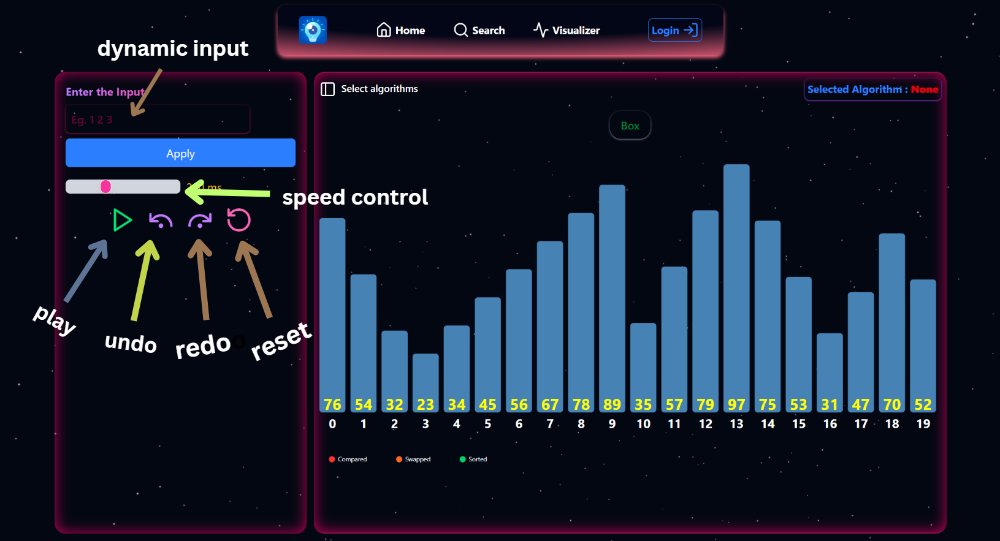
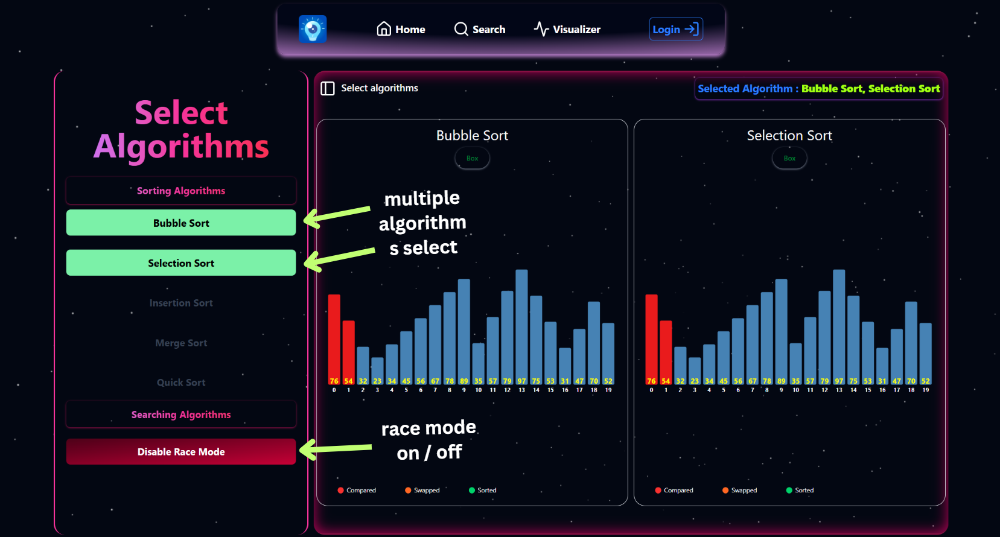
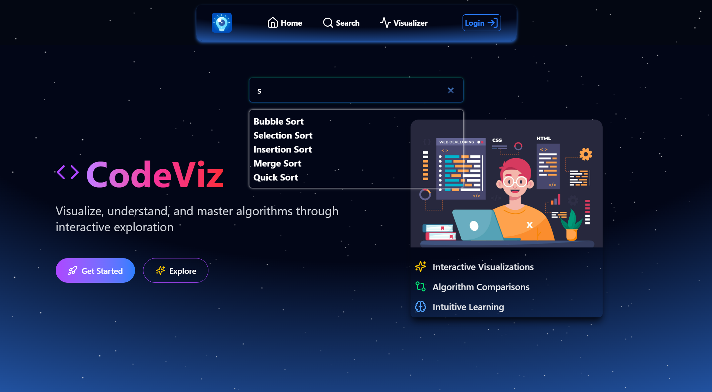
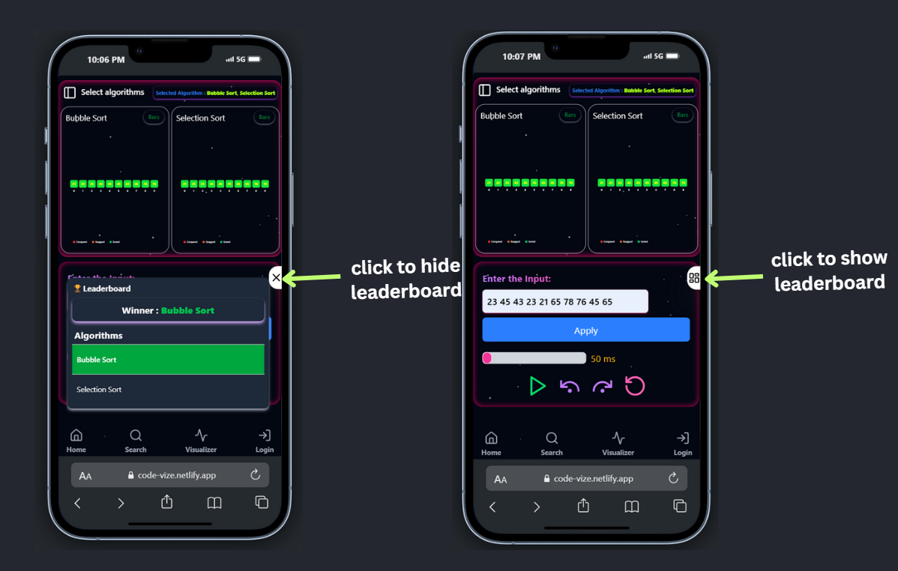

#  DSA Visualizer

# Introduction
The DSA Visualizer is an interactive tool designed to help users understand and analyze Data Structures and Algorithms (DSA) through real-time visual representations. Built with React.js and styled using Tailwind CSS v4, this tool provides an intuitive and engaging experience for learners.

# Key Features

#### <li> Interactive Visualizations – Step-by-step execution with dynamic updates
#### <li> Algorithm Race Mode – Side-by-side comparisons with real-time performance tracking
#### <li> Custom Input Support – Users can input custom datasets for better understanding
#### <li> Leaderboard System – Displays the fastest algorithm for different scenarios
#### <li> Extensible Architecture – Easily add new algorithms and enhancements

# 🛠️ Tech Details
Frontend
#### <li> Framework: React.js (with functional components & hooks)
#### <li> Styling: Tailwind CSS v4 for a modern and responsive UI
#### <li> Animations: Framer Motion for smooth algorithm visualizations
#### Tilt Effect : "react-parallax-tilt"

# How to Use (with screenshots),
## Visualizer

## Controller

## Progress Bars Section

## Multiple Algoritms Selection

## Search bar for algorithms selecting dynamically

# Leaderboard

# Project Structure

# Future Enhancements.
## 🔹 More Algorithm Support
Implement Sorting Algorithms

#### <li> Searching Algorithms
 Linear Search, Binary Search
#### <li> Graph Algorithms
BFS, DFS, Dijkstra’s, Prim’s, Kruskal’s
#### <li> Dynamic Programming
Fibonacci, Knapsack, LCS, LIS 
#### <li> Greedy Algorithms
Activity Selection, Huffman Coding
### etc...

## 🔹 User Interactivity Improvements
Enable drag-and-drop support for creating custom graph structures.

## 🔹 Customization & Theming
Introduce dark mode and custom themes.

## Code Highlighter
introduce the algo pueodo code highliter 
